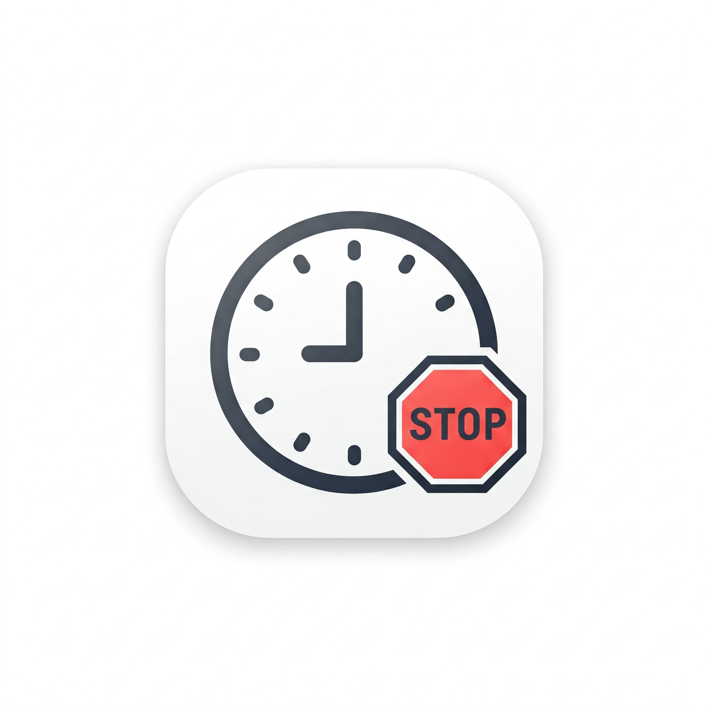
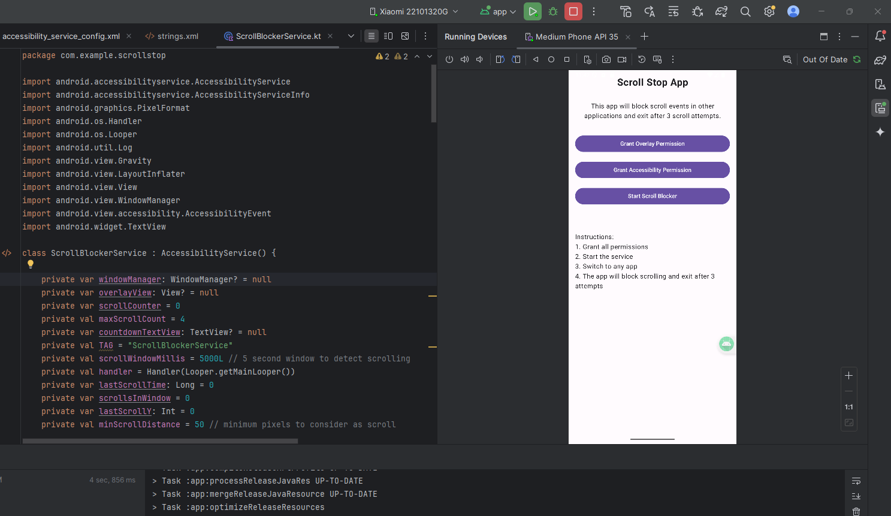

# ScrollStop

A simple Android app that use accessibility service and watchout for users "myself" to control their endless scrolling habits on popular social media apps.



## Features

- Monitors scrolling behavior in popular apps (Chrome, Instagram, Facebook, WhatsApp)
- Shows warning overlays after rapid scrolling
- Automatically exits apps after excessive scrolling
- Customizable scroll detection settings
- Minimal performance impact

## Installation

### Manual Installation
1. Download the latest APK from [Releases](https://github.com/gyzi/scrollstop/releases)
2. Enable "Install from Unknown Sources" in your Android settings
3. Open the APK file to install

## Setup

1. Open ScrollStop app
2. Grant accessibility permission when prompted
3. Grant overlay permission when prompted
4. The service will start automatically

## Usage

1. Use your apps normally
2. ScrollStop will monitor scrolling behavior
3. Warnings appear after detecting rapid scrolling
4. App will close after reaching maximum scroll limit
5. Counter resets after a period of no scrolling

## For Developers



### Prerequisites
- Android Studio Arctic Fox or newer
- Android SDK 21 or higher
- Kotlin 1.5.0 or higher

### Import Project
1. Clone the repository:
```bash
git clone https://github.com/gyzi/scrollstop.git
```

2. Open in Android Studio:
- File → Open
- Navigate to the cloned directory
- Click "OK"

3. Build From Studio, if case of error use debugging tools and Gemini for help

4. Test and Run on: 
    * Connect Android device or start emulator
    * Run in Android Studio or use:
```bash
./gradlew installDebug
```

5. Publishing Steps 
 Generate signed APK:
   - Android Studio → Build → Generate Signed Bundle/APK
   - Choose APK
   - Create or select keystore
   - Choose release build variant

